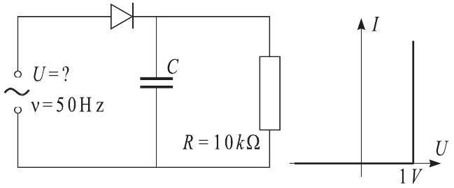

**6. RECTIFIER (8 points)**

A voltage rectifier is made according to the circuit shown in the figure. The load
$R=10 \mathrm{k} \Omega$ carries a DC current $I=2 \mathrm{~mA}$. In what
follows, we approximate the U-I characteristic of the diode by the curve shown in
the figure. The relative variation of the current through the load must satisfy
the condition $\Delta I / I<1 \%$.

1) Find the average power dissipation in the diode in the operating regime of such
a circuit.

2) Determine the amplitude of the AC voltage, with frequency $\nu=50 \mathrm{~Hz}$,
that must be applied to the input of the circuit.

3) Find the required capacitance $C$.

4) Find the average power dissipation in the diode during the first period of the
AC input voltage immediately following the application of the AC voltage to the
input of the circuit.
