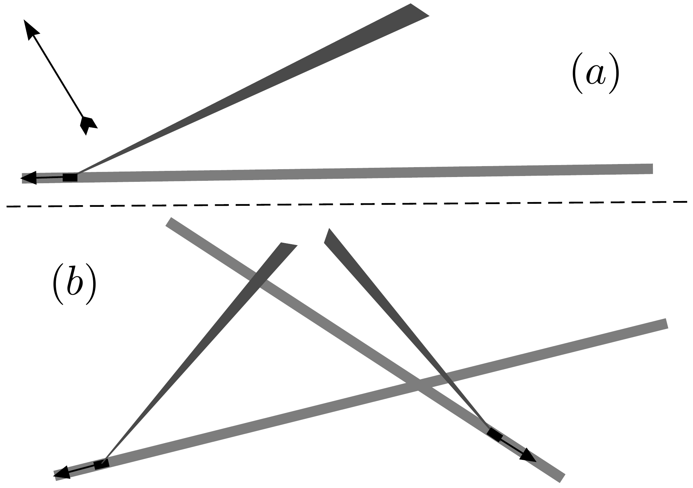

**3. TRACTOR (6 points)**

The provided sketches (a) and (b) are based on satellite images and preserve the
proportions. They show tractors together with their smoke trails. The tractors
were moving along the roads in the directions indicated by the arrows. The speed
of every tractor was $v_{0}=30 \mathrm{~km} / \mathrm{h}$. In sketch (a), the wind
direction is indicated by another arrow.

1) Using the provided sketch, find the wind speed for case (a).

2) Using the provided sketch, find the wind speed for case (b).
