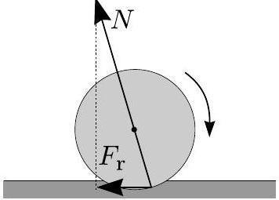

3. Ball ( 8 points) A homogeneous ball of radius $R$ and mass $m$ is thrown horizontally onto a table at the moment of time $t=0$. Its initial velocity before contact is purely horizontal and equal to $v$; it is non-rotating. Coefficient of kinetic friction between the table and the ball is $\mu$.
i) Find the moment of time $t$, when the ball stops sliding, i.e. starts rolling without sliding.
ii) Calculate the angular velocity of the ball $\omega_{*}$ and its total mechanical energy $E_{*}$ at the moment when it stops sliding. In the case of a hollow sphere, would the energy $E_{*}$ be larger or smaller than in the case of a homogeneous ball?
iii) Now, assume that the horizontal surface is treated so that the coefficient of kinetic friction depends on the horizontal coordinate $x$ as $\mu=a+b \cos x$ (with $a>b$ ). Find the expression for the terminal mechanical energy $E_{*}^{\prime}$ in this new case. iv) Now, let us return to the case of constant kinetic friction coefficient $\mu$. However, let us assume that the surface is not perfectly rigid (e.g. covered by a felt cloth). This gives rise to a second friction force - the rolling friction force $F_{r}=\mu_{r} m g$. Unlike the kinetic friction force, it is not tangential to the touching point of the ball and the surface. Instead, it can be interpreted as the horizontal component of the surface reaction force (the entire reaction force is, of course, normal to the surface), see Fig. Find the expression for the terminal mechanical energy $E_{*}^{\prime \prime}$ in this case. What is the most important (qualitative) difference between the expressions for $E_{*}$ and $E_{*}^{\prime \prime}$ ?

Hint: The moment of inertia of a ball is $I=\frac{2}{5} M R^{2}$.