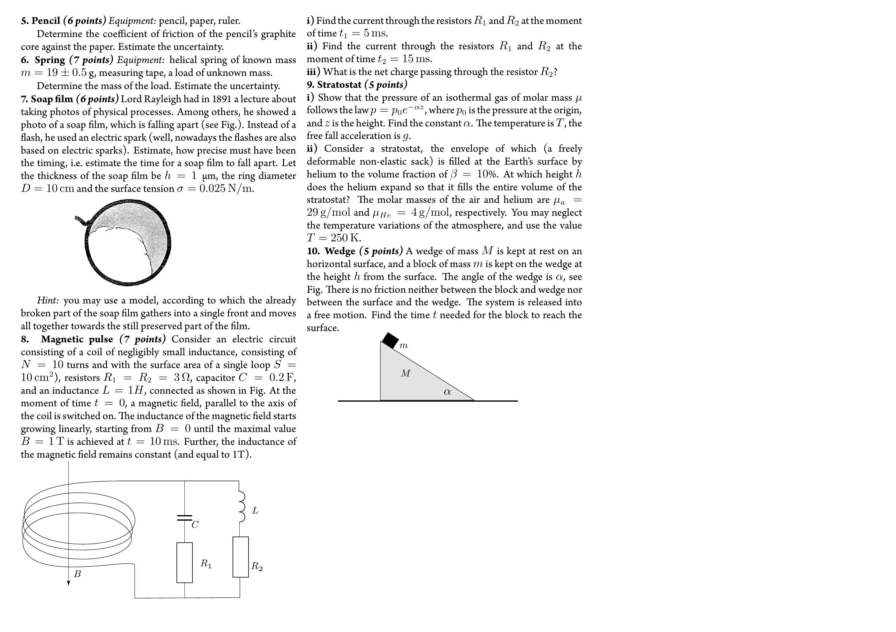

7. Soap film ( 6 points) Lord Rayleigh had in 1891 a lecture about taking photos of physical processes. Among others, he showed a photo of a soap film, which is falling apart (see Fig.). Instead of a flash, he used an electric spark (well, nowadays the flashes are also based on electric sparks). Estimate, how precise must have been the timing, i.e. estimate the time for a soap film to fall apart. Let the thickness of the soap film be $h=1 \mu \mathrm{~m}$, the ring diameter $D=10 \mathrm{~cm}$ and the surface tension $\sigma=0.025 \mathrm{~N} / \mathrm{m}$.

Hint: you may use a model, according to which the already broken part of the soap film gathers into a single front and moves all together towards the still preserved part of the film.