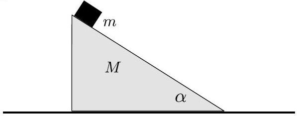

10. Wedge (5 points) A wedge of mass $M$ is kept at rest on an horizontal surface, and a block of mass $m$ is kept on the wedge at the height $h$ from the surface. The angle of the wedge is $\alpha$, see Fig. There is no friction neither between the block and wedge nor between the surface and the wedge. The system is released into a free motion. Find the time $t$ needed for the block to reach the surface.
