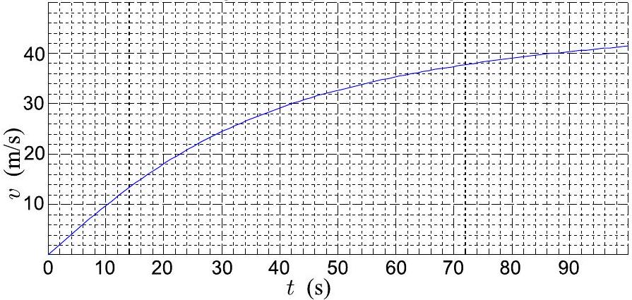

**10. ICE-RALLY (7 points)**

The car accelerates on a slippery ground so that the wheels are always at the limit of slipping (e.g. via using an electronic traction control). Such an acceleration would result in the velocity vs time graph as given in the Figure.

**i)** *(2 pt)* What is the coefficient of friction, assuming a four-wheel drive?

Because of a manual gear change, there is time period of $\tau_1 = 0.5$ s, during which there is no driving force (so that the car decelerates due to air friction). Except for that period, the acceleration follows the law given by the graph. As a result, the terminal velocity $v_t = 40$ m/s is reached $\tau_2 = 1.0$ s later than it would have been reached, if there were no delay caused by the gear change. Upon reaching the terminal velocity, the car continues moving at constant speed. In your calculations, you can assume that the air friction was constant during the gear change period.

**ii)** *(2.5 pt)* At which speed the gear was changed?

**iii)** *(2.5 pt)* How many meters shorter distance will be covered during the first 100 seconds, as compared to ideal acceleration (i.e. without the delay due to the gear change)?
