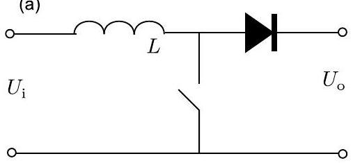
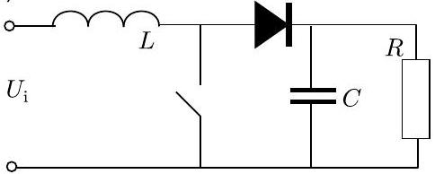

**9. POWER SUPPLY (6 points)**

**i)** *(2 pt)* Consider the circuit given in Fig (a), where the diode can be assumed to be ideal (i.e. having zero resistance for forward current and infinite resistance for reverse current). The key is switched on for a time $\tau_c$ and then switched off, again. The input and output voltages are during the whole process constant and equal to $U_i$ and $U_o$, respectively ($2U_i < U_o$). Plot the graphs of input and output currents as functions of time.

**ii)** *(2 pt)* Now, the key is switched on and off periodically; each time, the key is kept closed for time interval $\tau_c$ and open — also for $\tau_c$. Find the average output current.

**iii)** *(2 pt)* Now, circuit (a) is substituted by circuit (b); the switch is switched on and off as in part ii. What will be the voltage on the load $R$, when a stationary working regime has been reached? You may assume that $\tau_c \ll RC$, i.e. the voltage variation on the load (and capacitor) is negligible during the whole period (i.e. the charge on the capacitor has no time to change significantly).
