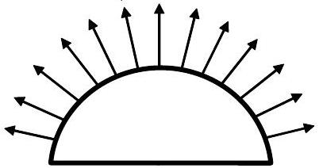

**8. SPRINKLER (3 points)**

A sprinkler has a shape of hemisphere, which has small holes drilled into the spherical part of its surface. From these small holes, water flows out with velocity $v = 10$ m/s. Near the sprinkler, the water flow is distributed evenly over all the directions of the upper half-space. The sprinkler is installed at the ground level so that its axis is vertical. In what follows, the air resistance can be neglected, and the dimensions of the sprinkler can be assumed to be very small.

**i)** *(1.5 pt)* Find the surface area of the ground watered by the sprinkler.

**ii)** *(1.5 pt)* At which distance from the sprinkler is the watering intensity (mm/h) the highest?
