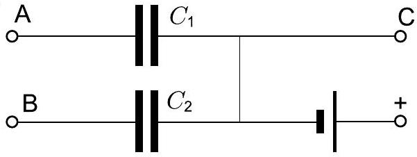

**4. BLACK BOX (10 points)**

Equipment: a black box with three terminals, voltmeter, timer. Inside the black box, there are two capacitors and a battery, connected as shown in Figure. The capacitance $C_1 = (3400 \pm 400) \, \mu\text{F}$; you are asked to determine the capacitance $C_2$ and estimate the uncertainty. Remark: the terminal "+" is a wire, long enough to be connected to either terminal "A" or terminal "B".

