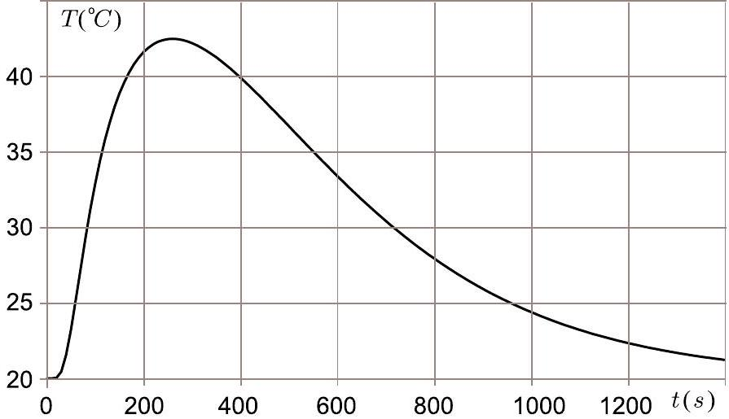

**8. HEAT SINK (6 points)**

Consider a heat sink in the form of a copper plate of a constant thickness (much smaller than the diameter $d$ of the plate). An electronic component is fixed to the plate, and a temperature sensor is fixed to the plate at some distance from that component. You may assume that the heat flux (i.e. power per unit area) from the plate to the surrounding air is proportional to the difference of the plate temperature at the given point (the coefficient of proportionality is constant over the entire plate, including the site of the electronic component).

**i) (2 pts)** The electronic component has been dissipating energy with a constant power of $P = 35 \, \text{W}$ for a long time, and the average plate temperature has stabilized at the value $T_0 = 49 \, °\text{C}$. Now, the component is switched off, and the average plate temperature starts dropping; it takes $\tau = 10 \, \text{s}$ to reach the value $T_1 = 48 \, °\text{C}$. Determine the heat capacity $C$ (units $\text{J}/°\text{C}$) of the plate. The capacities of the electronic component and the temperature sensor are negligible.

**ii) (4 pts)** Now, the electronic component has been switched off for a long time; at the moment $t = 0$, a certain amount of heat $Q$ is dissipated at it during a very short time. In the Figure and Table, the temperature is given as a function of time, as recorded by the sensor. Determine the dissipated heat amount $Q$.

| $t \, (\text{s})$ | 0 | 20 | 30 | 100 | 200 | 300 |
| --- | --- | --- | --- | --- | --- | --- |
| $T \, (°\text{C})$ | 20.0 | 20.0 | 20.4 | 32.9 | 41.6 | 42.2 |

| $t \, (\text{s})$ | 400 | 600 | 800 | 1000 | 1200 | 1400 |
| --- | --- | --- | --- | --- | --- | --- |
| $T \, (°\text{C})$ | 39.9 | 33.4 | 27.9 | 24.4 | 22.3 | 21.2 |
