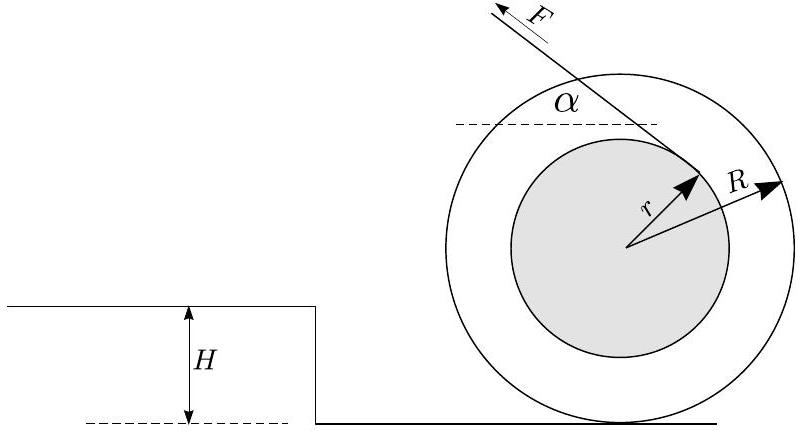

**1. SPOOL (12 points)**

A spool with inner radius $r$ and outer radius $R$ lies on a horizontal table; the axis of the spool is horizontal. A weightless rope is wound around the inner part as shown in the picture. The loose end of the rope makes an angle $\alpha$ with the horizontal (the angle $\alpha$ can be also negative). The moment of inertia of the spool is $J$ and mass $M$. In what follows you may assume that the spool rolls on the table without slipping.

**i) (2 pts)** We pull the loose end of the rope with velocity $u$ (parallel to the loose part of the rope; that loose part can be thought to be very long). What is the velocity of the spool?

**ii) (3 pts)** Suppose now that the spool is at rest, and we apply force $F$ to the loose end of the rope (parallel to the loose part of the rope). What is the acceleration of axis of the spool?

**iii) (2 pts)** How large does the coefficient of friction $\mu$ need to be (as a function of $\alpha$) to ensure that there is no slipping between the spool and the table?

**iv) (1.5 pts)** Now the spool rolls, again, with velocity $u$; however there is no rope. The spool hits a threshold of height $H$ (see Figure); the impact is perfectly inelastic. What is the speed $v$ of the spool immediately after the impact?

**v) (1.5 pts)** What is the speed $w$ of the spool after rolling over the threshold? Assume that $u$ is such that the spool will roll over the threshold without losing contact with its edge.

**vi) (2 pts)** If the speed $u$ is too large, $u > u_0$, the spool will jump up and lose contact with the edge of the threshold. Determine $u_0$.
