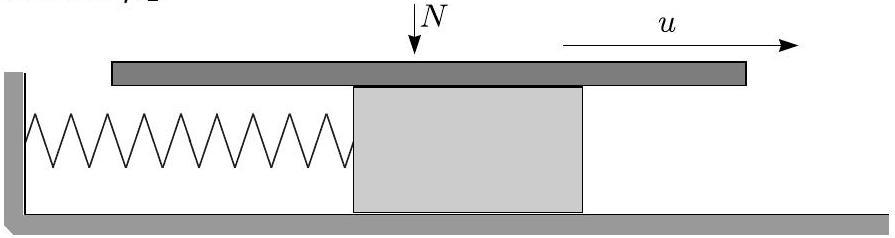

**6. VIOLIN STRING (9 points)**

The motion of a bow puts a violin string into a periodic motion. Let us make a simplified model of this process. The string has elasticity and inertia, so we substitute it by a block of mass $m$, fixed via a spring of stiffness $k$ to a motionless wall and laying on a frictionless horizontal surface. The bow is substituted by a horizontal plate, which is pressed with constant force $N$ downwards, and which moves with a constant velocity $u$, parallel to the axis of the spring, see Figure. The static coefficient of friction between the plate and the block is $\mu_1$, and the kinetic coefficient of friction is $\mu_2 < \mu_1$. So, as long as the plate does not slide with respect to the block, the coefficient of friction equals to $\mu_1$; as soon as there is some slip, it decreases down to $\mu_2$.

**i) (2 pts)** For questions (i) and (ii), let us assume that the speed of the plate $u$ is very small as compared to the maximal velocity of the block. What is the maximal velocity of the block $v_{\max}$ (maximized over time)?

**ii) (2 pts)** Sketch qualitatively the graph of the displacement of the block as a function of time and indicate on the graph the durations of the prominent stages of the block motion (graph segments).

**iii) (1.5 pts)** Now, let us abandon the assumption about the smallness of $u$. Sketch qualitatively the graph of the velocity of the block as a function of time.

**iv) (2.5 pts)** Determine the amplitude $A$ of the block's oscillations.

**v) (1 pt)** Which condition (strong inequality, $\gg$ or $\ll$) must be satisfied for $u$ in order to ensure that the oscillations will be almost harmonic?
