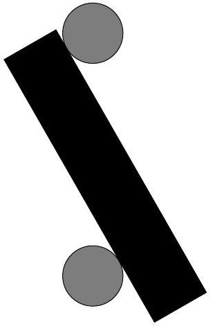

## Problem 3. Bars and rod (5 points)

Two cylindrical horizontal bars are fixed one above the other; the distance between the axes of the bars is $4 d$, where $d$ is the diameter of the rod. Between the bars, a cylindrical rod of diameter $d$ is placed as shown in Figure (this is a vertical cross-section of the system). The coefficient of friction between the rod and the bars is $\mu=\frac{1}{2}$. If the rod is long enough, it will remain in equilibrium in such a position. What is the minimal length $L$ of the rod required for such an equilibrium?
