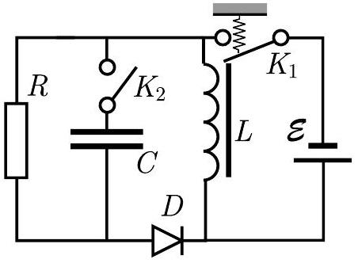

**1. DC-DC CONVERTER (8 points)**

In order to obtain high voltage supply using a battery, the following circuit is used.

An electromagnetic switch $K_{1}$ connects a battery of electromotive force $\mathscr{E}$ to an inductor of inductance $L$ : it is closed if there is no current in the inductor (a spring keeps it closed), but if the inductor current reaches a critical value $I_{0}$, magnetic field created by the inductor pulls it open. Due to inertia, once the key is open, it takes a certain time $\tau_{K}$ to close again even if the current falls to zero.

For the diode $D$ you may assume that its current is zero for any reverse voltage $\left(V_{D}<0\right.$ ), and also for any forward voltage smaller than the opening voltage $V_{0}$ (i.e. for $0<V_{D}<V_{0}$ ). For any non-zero forward current, the diode voltage $V_{D}$ remains equal to $V_{0}$.

You may express your answers in terms of $L, \mathscr{E}, I_{0}, V_{0}$, and the capacitance $C$ (see figure).

**i)** *(1 point)* At first, let the key $K_{2}$ be open. If the initial inductor current is zero, how long time $\tau_{L}$ will it take to open the key $K_{1}$ ?

**ii)** *(1 point)* Assuming (here and in what follows) that $L / R \ll \tau_{K} \ll \tau_{L}$, plot the inductor current as a function of time $t$ (for $0 \leq t<3 \tau_{L}$ ).

**iii)** *(1 point)* What is the maximal voltage $V_{\mathrm{max}}$ on the resistor $R$ ?

**iv)** *(2 points)* Assuming that $V_{\max} \gg V_{0}$, what is the average power dissipation on the diode?

**v)** *(2 points)* Now, let the key $K_{2}$ be closed, and let us assume simplifyingly that $V_{0}=0$; also, $R C \gg \tau_{L}$ and $\tau_{K}>\pi \sqrt{L C}$. Suppose that the circuit has been operated for a very long time. Find the average voltage on the resistor.

**vi)** *(1 point)* Find the amplitude of voltage variations on the resistor.