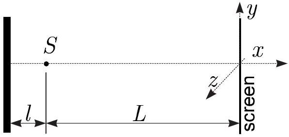

**8. MIRROR INTERFERENCE (5 points)**

A point source $S$ emits coherent light of wavelength $\lambda$ isotropically in all directions; thus, the wavefronts are concentric spheres. The waves reflect from a dielectric surface placed at a distance $l=N \lambda$ (where $N$ is a large integer) from the point source, and the interference pattern is observed on a screen which is placed to a distance $L \gg l$ from the point source (see figure).

In what follows we use the $x, y$, and $z$ coordinates as defined in the figure. The screen is parallel to the mirror and lies in the $y-z$ plane.

**i)** *(2 points)* At which values of the $y$ coordinate (for $z=0$ ) are the interference maxima observed on the screen? You may assume that $y \ll L$.

**ii)** *(1 point)* Sketch the shape of few smallestsized interference maxima on the screen (in $y-z$-plane).

**iii)** *(2 points)* Now the flat screen is replaced with a spherical screen of radius $L$, centred around the point source. How many interference maxima can be observed?