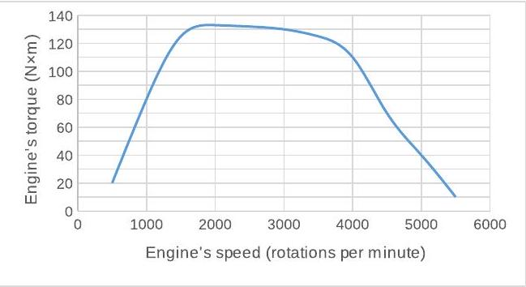

**3. GEAR SHIFT (3 points)** — *K.A. Saar*

The maximum torque of a car's engine depends on the engine's rotation speed (see the following figure, a larger copy is on an extra sheet).

The rotations of the engine are transferred to the wheels through a transmission gearbox. When the car is in the first gear, then the gear ratio from the engine to the wheels is 14:1; in the second gear, the gear ratio is 7:1.

i) *(2 points)* At what speed of the car should the transmission be shifted from the first gear into the second, in order for the average acceleration of the car to be maximum?

ii) *(1 point)* What is the acceleration of the car immediately before and immediately after the gear change?

Neglect any drag force. The mass of the car $m=1400 \mathrm{~kg}$, the diameter of a wheel is $d=60 \mathrm{~cm}$.
