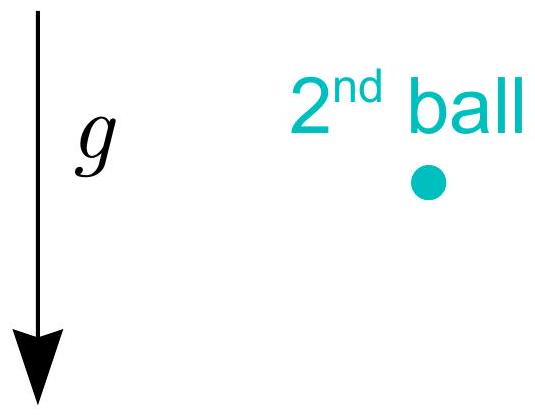

**6. TWO BALLS (5 points)** — *J. Kalda*

The following snapshot (a larger version is on an extra sheet) depicts two balls that were thrown simultaneously and with the same initial speed, but in different directions from point $P$. What was the initial speed? Use $g=9.8 \mathrm{~m} / \mathrm{s}^{2}$.

