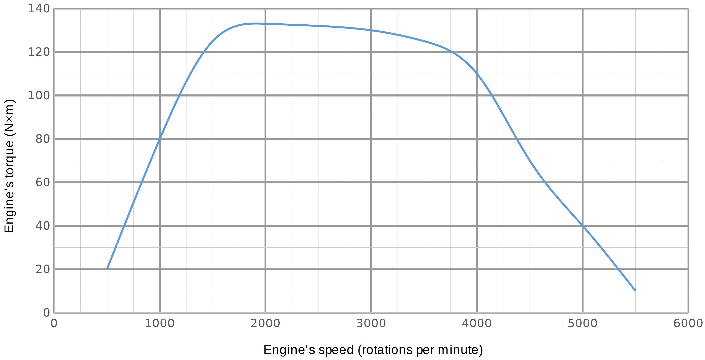

**10. VAPOUR PRESSURE (8 points)** — *J. Kalda, M. Heidelberg, E. Uustalu*

Measure the room temperature saturated vapour pressure of the unknown fluid in the syringe. The volume of the bottle is $V=0.50 \ell$, the inner diameter of the pipe is $d=6.0 \mathrm{~mm}$. Current air pressure $p_{0}$ and room temperature $T_{0}$ are written on the blackboard. There is no need to repeat the measurement after a successful attempt as getting the bottle free from vapours is time consuming. Estimate the uncertainty of the result.

Equipment: syringe with an unknown fluid, syringe with water, bottle, flexible pipe, ruler, plug, stand, tape.

