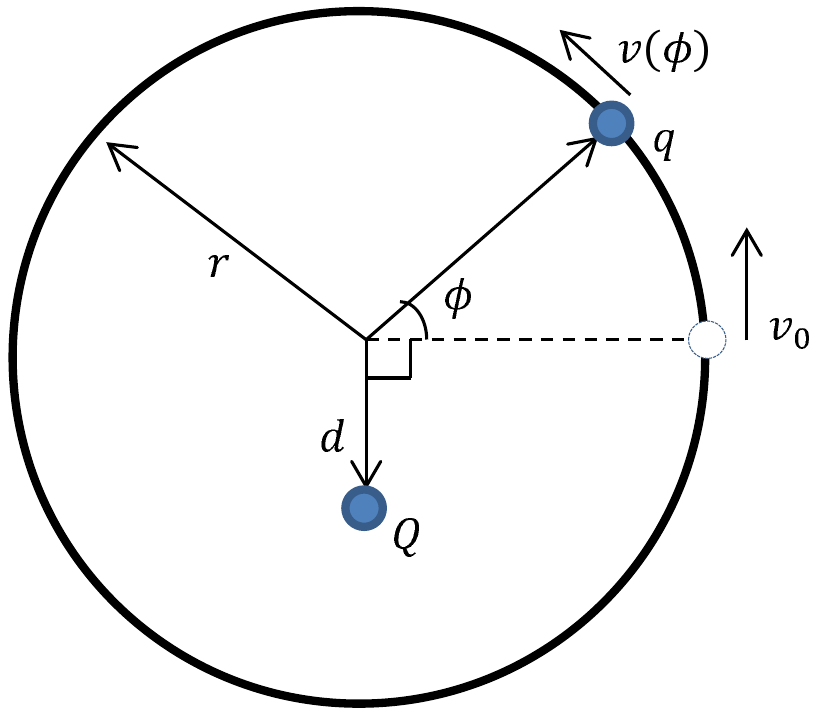

**6. CHARGE ON A RING (7 points)** — *Andreas Isacsson.*

A pointlike particle with mass $m$ and charge $q$ is free to slide without friction along a fixed horizontal circular ring with radius $r$. In the plane of the ring, another charge $Q$ is placed in a fixed position, at a distance $d$ from the center of the ring, with $d<r$ (see figure).

**i)** *(3 points)* The particle on the ring is given an initial velocity $v_{0}$. Calculate its velocity $v$ as a function of the angle $\phi$, $v(\phi)$.

**ii)** *(2 points)* How large is the force from the ring on the particle, as a function of the angle $\phi$ ?

**iii)** *(2 points)* Viscous friction can be modelled with a force directed against the velocity, with a magnitude proportional to the speed, i.e. $\left|F_{f}\right|= m \gamma v$, where $\gamma$ is a positive constant. Assume that this kind of frictional force acts on the particle on the ring. Given an initial $v_{0}$, determine the position where the particle comes to rest.
