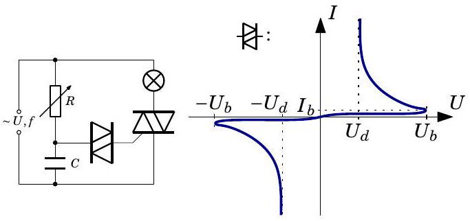
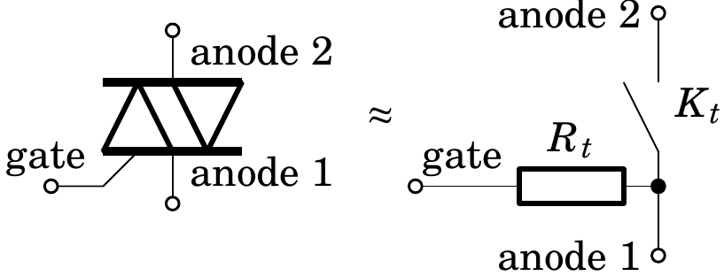
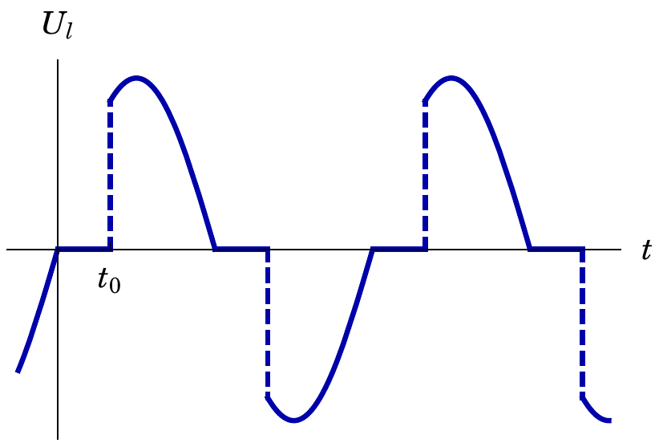

**4. DIMMER (9 points)** — *Siim Ainsaar.*

A dimmer for controlling the brightness of lighting consists of a rheostat, a capacitor, a diac and a triac, connected as in the schematics.

A diac is a component whose behaviour is determined by the voltage-current diagram shown above. A triac, on the other hand, can be thought of as a switch controlled by current—look at the following equivalent schematics.

The switch $K_{t}$ is open as long as the current through the triac's gate stays under the threshold current $I_{t}$; closes when the threshold current is applied (in either direction) and stays closed while a current is flowing through the switch $K_{t}$ (the gate current is irrelevant until the switch opens again).

**i)** *(3 points)* Assume that the resistance $R_{t}$ is large enough that the charge moving through the diac can be neglected. Let the sinusoidal supply voltage have a maximum value of $U$ and a frequency of $f$; the rheostat be set to the resistance $R$ and the capacitor's capacitance be $C$. Find the maximum value of the voltage $U_{C}$ on the capacitor, and its phase shift $\varphi$ with respect to the supply voltage.

**ii)** *(2 points)* What inequality should be satisfied by the diac's characteristic voltages $U_{b}$ and $U_{d}$, triac's threshold current $I_{t}$ and gate resistance $R_{t}$ to ensure that when the diac starts to conduct (while the voltage on the capacitor rises), then the triac would also immediately start to conduct? You may assume that $I_{b}<I_{t}$ and that the diac's voltage at current $I_{t}$ is $U_{d}$.

**iii)** *(2 points)* The voltage $U_{l}$ on the lamp follows the plot above. Let's assume that the assumption of part i) and the inequality of part ii) hold. Find the time $t_{0}$ during which the voltage on the lamp is zero.

**iv)** *(2 points)* Express through $t_{0}$ and $f$, how many times the average power of the lamp is lower than the one of a lamp without a dimmer, assuming that the resistance of the lamp is unchanged.
