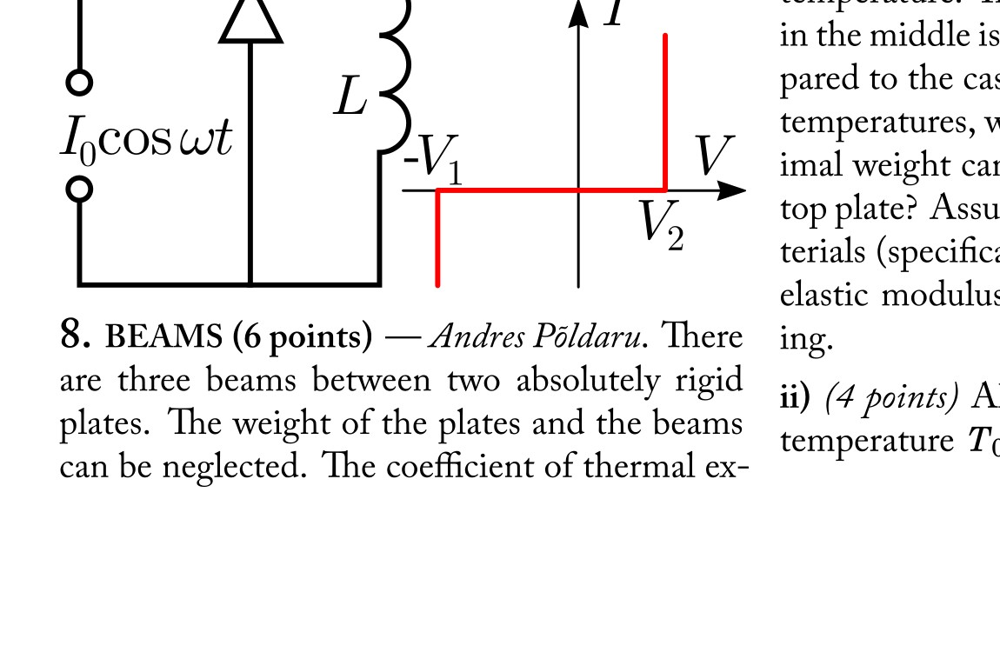
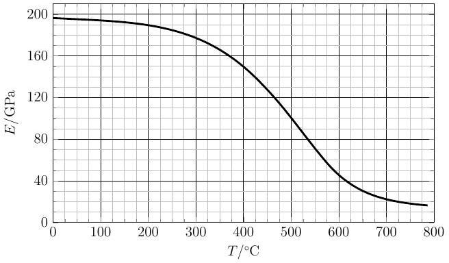

**8. BEAMS (6 points)** — *Andres Põldaru.*

There are three beams between two absolutely rigid plates. The weight of the plates and the beams can be neglected. The coefficient of thermal expansion of the beams is $\alpha = 1.0 \times 10^{-5}\ \mathrm{K^{-1}}$. The maximum strain (relative length change compared to the no load case) before permanent inelastic deformations of the material of the beam is $\beta = 0.40\%$. The beams can support a maximum amount of weight on the top plate, at which point permanent deformations start taking place in some of the beams.

**i)** *(2 points)* Initially all the beams are at the same temperature. Then the temperature of the beam in the middle is increased by $\Delta T = 100\ \mathrm{K}$. Compared to the case when the beams were at equal temperatures, what fraction of the original maximal weight can the beams now support on the top plate? Assume that the properties of the materials (specifically the maximum strain and the elastic modulus) don't change during the heating.

**ii)** *(4 points)* All of the beams are originally at temperature $T_0 = 0°\mathrm{C}$. A load of 20% of the maximal load is placed on the top plate. Keeping the same load on, to what temperature can the beam in the middle be heated such that no permanent deformations occur? This time the elastic modulus of the material changes depending on the temperature as shown in the figure below (a larger figure is given on an extra sheet).

Hint (added during the competition): the elastic modulus or Young modulus $E$ is defined by the formula $F/A = E \Delta l / l$, where $F$ is the force, $A$ is the area and $\Delta l / l$ is the relative lengthening.

