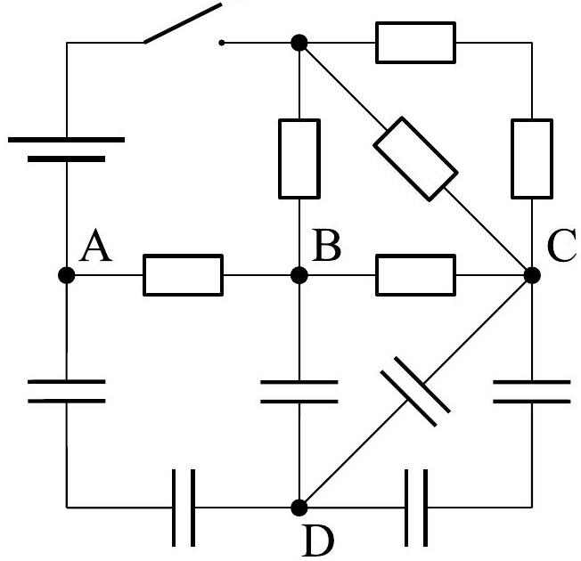

**3. RESISTORS AND CAPACITORS (5 points)** — *Mihkel Heidelberg.*

A circuit is made out of a battery, a switch, resistors and capacitors as shown in the image. The resistors all have a resistance of $R$, the capacitors all have a capacitance of $C$ and the battery has a voltage of $U$. The point A is connected to the ground and so it has a potential of 0 V. In the beginning the switch is open and all the capacitors have no charge.

**i)** *(2 points)* What is the potential at points B and C after we have closed the switch and waited for all the potentials to stabilize?

**ii)** *(3 points)* What is the potential at point D after we have closed the switch and waited for all the potentials to stabilize?
