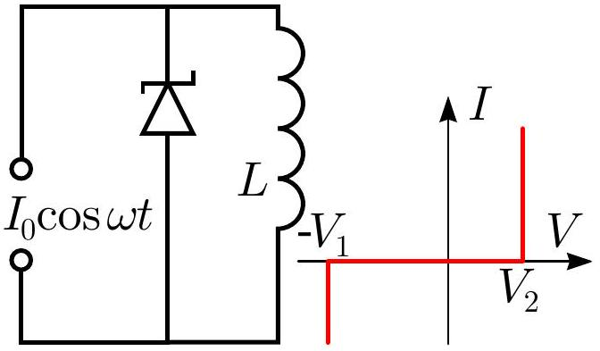

**7. ZENER (7 points)** — *Jaan Kalda.*

A Zener diode is connected to a source of alternating current as shown in the figure. The current is sinusoidal $I = I_0 \cos \omega t$ with a constant amplitude. The inductance $L$ of the inductor is such that $L \omega I_0 \gg V_1, V_2$, where $V_1$ and $V_2$ are the breakdown voltages ($V_1 > V_2$). The current-voltage characteristic of the Zener diode is shown in the figure. In the following assume that a very long time has passed since the current source was first turned on.

**i)** *(5 points)* Find the average current $\langle I \rangle$ through the inductor.

**ii)** *(2 points)* Find the peak-to-peak amplitude of the current changes $\Delta I$ in the inductor.
