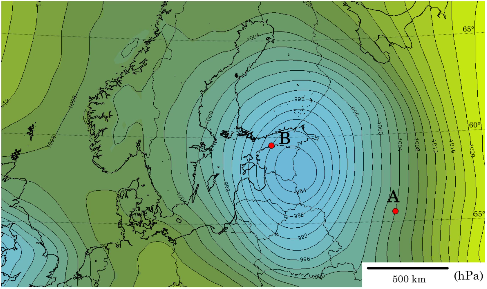
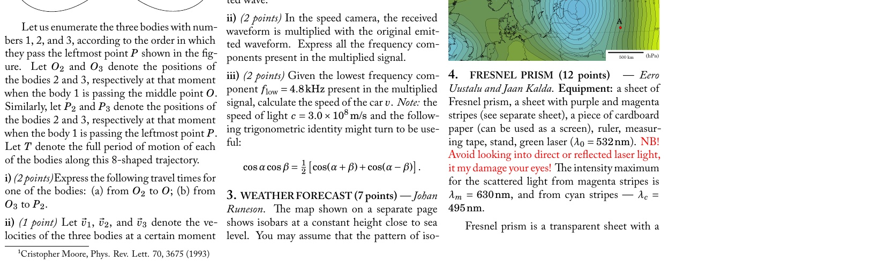

**3. WEATHER FORECAST (7 points)** — *Johan Runeson.*

The map shown on a separate page shows isobars at a constant height close to sea level. You may assume that the pattern of isobars is stationary in time (changes very slowly).

**i)** *(2 points)* Sketch the direction of the wind velocity at the points A and B.

**ii)** *(2.5 points)* Estimate the magnitude of the wind velocity at point A. Make use of the fact that at point A, the lines of constant pressure are almost straight. The density of air near the ground $\rho = 1.23\ \mathrm{kg/m^3}$.

**iii)** *(2.5 points)* Estimate the magnitude of the wind velocity at point B.

**Hint.** When an object of mass $m$ (for example a slab of air) is moving with velocity $v$ in a frame of reference rotating with angular velocity $\Omega$, it feels a fictitious force called the Coriolis force given by $F_{C}/m = 2v\Omega \sin \varphi$, where the angle $\varphi$ and the directions are indicated in the figure below.

