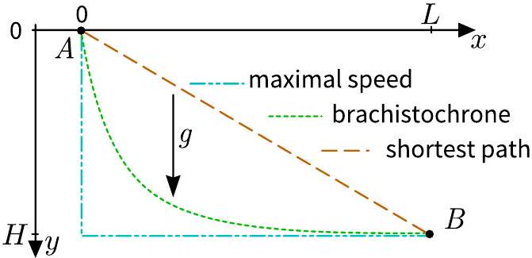
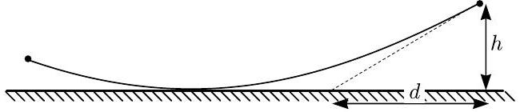

**5. BRACHISTOCHRONE (10 points)** — *Rūdolf Treilis.*

Consider points $A$ and $B$ separated by height $H$ in the vertical direction and distance $L$ in the horizontal direction, placed in a gravitational field $g$ as shown in the figure below. A point mass can slide along a rail of fixed shape frictionlessly (including taking 90°-turns) from $A$ to $B$. The brachistochrone curve is the curve minimizing the total travel time.

**i)** *(2 points)* Calculate the total travel time for the "maximal speed" and "shortest path" trajectories. Find the ratio $\frac{L}{H}$ for which the two are equal.

**ii)** *(2 points)* According to Fermat's principle, light ray travels from one point to another along the path of shortest travel time. Suppose that in a certain medium, a light ray can propagate from $A$ to $B$ along the brachistochrone curve shown in the figure above. Find the refractive index $n=n(x, y)$ as a function of the coordinates $x$ and $y$ for this medium if $n(L, H)=1$.

**iii)** *(2 points)* Show that the path of a light ray traveling in a medium with a variable refractive index $n(x, y) \equiv n(y)$ satisfies the differential equation $\frac{\mathrm{d} y}{\mathrm{~d} x}=\sqrt{C \cdot n(y)^{2}-1}$, where $C$ is a constant determined by boundary conditions.

**iv)** *(2 points)* The obtained equation can explain mirages, which occur when the index of refraction increases with height. Consider a light ray coming from the sky that grazes the surface of the Earth $(y=0)$ and hits the eye of an observer at height $h$ (for this task choose the y-axis in the opposite direction bottom of the page to top). If the refractive index varies as $n(y)=n_{0}(1+\alpha y)$ with $n_{0}$ and $\alpha$ constant, find an expression for the apparent distance that the ray of light is emanating from $d$.

**v)** *(2 points)* Solving the equations derived in parts ii) and iii), one may show that the brachistochrone curve is actually a segment of a cycloid. A cycloid is the curve traced by a fixed point on the rim of a circular wheel as it rolls along a straight line without slipping. For the special case $\frac{L}{H}=\frac{\pi}{2}$ find the minimum travel time $t_{\min }$ between $A$ and $B$.
