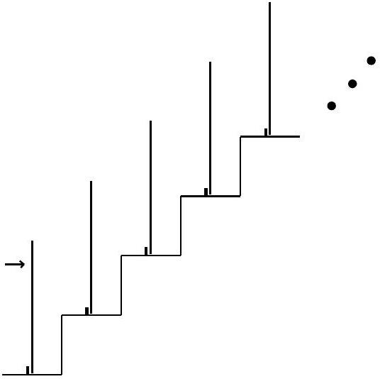

**7. DOMINOES (6 points)** — *Kaarel Hänni.*

David stands at the bottom of an infinite staircase with both step width and height being equal to $d$. The corner of each step is slightly rounded. In the middle of each step, there is initially an upright domino of length $\sqrt{5} d$ and negligible thickness. Behind the base of each domino, there is a small ridge that prevents it from sliding backward. David gives the first domino some initial angular velocity, and the dominoes start falling into each other. All collisions are perfectly inelastic, and there is no friction between two dominoes. David notices that after a while, all dominoes have equal initial angular velocity $\omega$. Find $\omega$.
