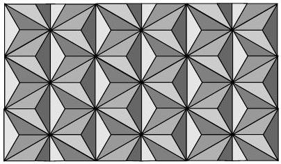
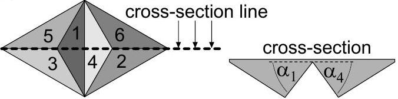

**4. RETROREFLECTIVE FILM (12 points)** — *Eero Uustalu and Jaan Kalda.*

You are given the following tools: a retroreflective film an enlarged bottom view of which is shown in the first figure; stand, ruler, laser pointer, screen, graph paper, protractor.

While the top surface of the film is flat, the bottom surface is a periodic array of slanted triangular faces. Six such faces are shown enlarged in the second figure; the faces 1, 3 and 5 are perpendicular to each other and form a corner of a cube, and the faces 2, 4 and 6 are also perpendicular to each other. On the right of the second figure, a crosssection of the film is shown. The film's material between the slanted faces and the flat surface form microprisms. The refracting angles of these microprisms are denoted by $\alpha_{i}, i=1,2, \ldots 6$ (the index numbers correspond to those of the faces). Among the angles $\alpha_{i}$, some may be equal to each other.

When light falls onto the flat surface close to perpendicular incidence, it undergoes total internal reflections on the slanted faces, and as a result, its direction of propagation is rotated by 180°. However, the microprisms can also serve as prisms diverting a light beam by an angle $\beta$. The angle $\beta$ depends on the angle of incidence, and on the prism angle $\alpha=\alpha_{i}$. Let $\beta_{i}$ denote the minimal deflection angle for a fixed prism angle $\alpha_{i}$.

**i)** *(2 points)* Perform experiment to relate the prism angles $\alpha_{i}$ (with $i=1,2, \ldots 6$ relating to the face number as shown in the figure) with equalities and inequalities. You may use the deduced equalities throughout this problem (reducing thereby the number of unknown angles). Note that the face corresponding to the index "1" can be chosen arbitrarily.

**ii)** *(2 points)* Determine the minimal deflection angles $\beta_{i}, i=1,2, \ldots 6$.

**iii)** *(4 points)* Determine the prism angles $\alpha_{i}$, $i=1,2, \ldots 6$.

**iv)** *(1 point)* Due to the fact that the faces 1, 3 and 5 are perpendicular to each other, the following equality holds:

$$\cos ^{2} \alpha_{1}+\cos ^{2} \alpha_{3}+\cos ^{2} \alpha_{5}=1 .$$

Similarly, $\cos ^{2} \alpha_{2}+\cos ^{2} \alpha_{4}+\cos ^{2} \alpha_{6}=1$. Use these equalities to adjust the result for the prism angles by adding and/or subtracting the same small value from your previously obtained angles' values.

**v)** *(3 points)* Determine the refraction coefficient of the film's material.
