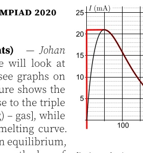
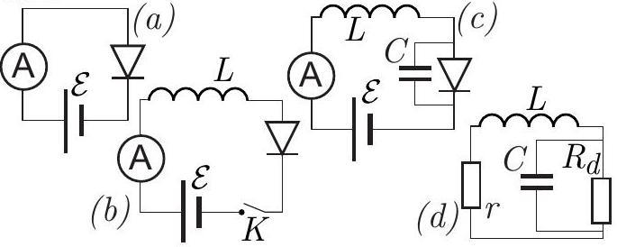

**2. TUNNEL DIODE (10 points)** — *Jaan Kalda.*

The V-I-curve of a tunnel diode is depicted in the figure below, curve (a). In some parts of the problem, we use an idealized model curve (b).

**i)** *(1 point)* In order to measure the V-I curve of the diode, it is connected in series with a variable power supply (the value of the electromotive force $\mathscr{E}$ can be changed from 0V to 1V), see circuit (a). The ammeter has internal resistance $r=2 \Omega$; the applied voltage is $\mathscr{E}=50 \mathrm{mV}$. What is the diode voltage $V_{i}$ and current $I_{i}$ ? Use the real V-I-curve of the diode.

**ii)** *(1 point)* Now, let us study the effect of the self-inductance of the wires. In order to take into account such an inductance, the circuit needs to be modified as shown in circuit (b); let $L=500 \mathrm{nH}$. The switch $K$ is kept open until the voltage is adjusted to $\mathscr{E}=250 \mathrm{mV}$, and is then closed. How long will it take for the current to reach $I_{1}=20 \mathrm{~mA}$ ? Neglect henceforth (until otherwise instructed) the internal resistances of the battery and of the ammeter (put $r=0$ ), and use the idealized VI-curve of the diode.

**iii)** *(1 point)* With the same settings as for task ii), how long will it take from the moment when the switch was closed until the diode voltage reaches $V_{2}=500 \mathrm{mV}$ ?

**iv)** *(2 points)* With the same setting as for task ii), plot the diode current as a function of time and find the period and amplitude of the current oscillations.

**v)** *(2 points)* Circuit (b) is used to measure the V-I curve of the diode: for each data point, the voltage is adjusted to the desired value while the switch is kept open, and then the switch is closed. Note that when the ammeter current oscillates with a high frequency, it shows the average current. Plot the expected measurement results, i.e. the average current through the ammeter as a function of the applied voltage $V=\mathscr{E}$.

**vi)** *(1 point)* Thus far we have assumed that the diode is an ideal device; in reality, it has a small parasitic capacitance, let it be $C=30 \mathrm{pF}$. Taking this into account, our circuit should be drawn as shown in diagram (c). Now we assume the ammeter, again, to be non-ideal, with internal resistance $r=2 \Omega$. Let us assume that after closing the switch, the voltage was slowly increased from $\mathscr{E}=0 \mathrm{mV}$ to $\mathscr{E}=150 \mathrm{mV}$ so that a stationary (oscillations-free) operation regime $V(t) \equiv V_{0}$ and $I(t) \equiv I_{0}$ has been achieved. Suppose there is a small perturbation to the diode current and voltage: $I=I_{0}+\delta I(t)$ and $V=V_{0}+\delta V(t)$, where $I_{0}$ and $V_{0}$ are the current and voltage in the stationary operational regime. For small perturbation amplitudes, the V-I-curve of the diode can be linearized, resulting in $\delta V=R_{d} \delta I$, where $R_{d}$ is the differential resistance of the diode. Determine the value of $R_{d}$.

**vii)** *(2 points)* Continuing with the previous question, one can show that the problem of stability for the circuit (c), i.e. the question if the small current perturbations $\delta I(t)$ will grow exponentially in time or not, is equivalent to the problem of stability for the circuit (d) (the battery is removed, and the diode is substituted with its differential resistance found by the previous task). What is the largest inductance of wires $L$ for which the system is stable?
