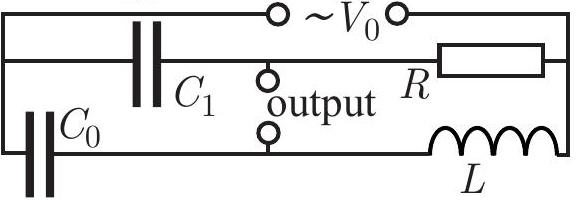

**4. AC FILTER (5 points)** — *Jaan Kalda.*

An alternating voltage with amplitude $V_0$ and circular frequency $\omega_0$ is
applied to the circuit shown below.

**i)** *(2 points)* For which circular frequency $\omega_0$ would the output voltage
be infinite?

**ii)** *(3 points)* Now let the circular frequency $\omega$ be twice the value found
in the previous task, $\omega = 2\omega_0$. The capacitance $C_1$ is chosen such that
the phase difference $\varphi$ between the input and output voltages is maximum
(parameters $C_0$, $L$ and $R$ are not changed). Find the phase shift $\varphi$ and
the output voltage amplitude $V_{\mathrm{out}}$.
