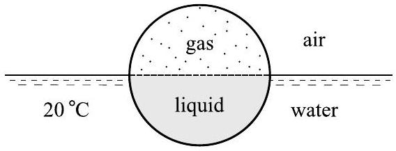
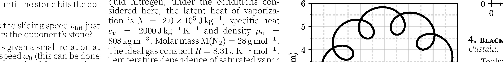

**2. Nitrogen explosion (8 points)** — *Päivo Simson.*

A half-sphere of radius $r=0.1 \mathrm{~m}$ is filled with liquid nitrogen at the boiling point temperature of $T_{1}=77.4 \mathrm{~K}\left(-195.8^{\circ} \mathrm{C}\right)$. The other half is then firmly sealed onto the first, creating a sphere containing liquid nitrogen and nitrogen gas, each occupying one-half of the volume. The sphere is immediately thrown into $T_{w}=20^{\circ} \mathrm{C}$ temperature water, where it floats exactly as shown in the figure below. After some time, it explodes.

The sphere is made of PCTFE plastic of density $\rho_{p}=2130 \mathrm{~kg} \mathrm{~m}^{-3}$, maximum tensile strength $\sigma=3.4 \times 10^{7} \mathrm{~N} \mathrm{~m}^{-2}$ (above this stress, the plastic will break) and thermal conductivity $k=0.84 \mathrm{~W} \mathrm{~m}^{-1} \mathrm{~K}^{-1}$. For liquid nitrogen, under the conditions considered here, the latent heat of vaporization is $\lambda=2.0 \times 10^{5} \mathrm{~J} \mathrm{~kg}^{-1}$, specific heat $c_{v}=2000 \mathrm{~J} \mathrm{~kg}^{-1} \mathrm{~K}^{-1}$ and density $\rho_{n}=808 \mathrm{~kg} \mathrm{~m}^{-3}$. Molar mass $\mathrm{M}\left(\mathrm{N}_{2}\right)=28 \mathrm{~g} \mathrm{~mol}^{-1}$. The ideal gas constant $R=8.31 \mathrm{~J} \mathrm{~K}^{-1} \mathrm{~mol}^{-1}$. Temperature dependence of saturated vapor pressure of nitrogen is shown below.

**i)** *(1.5 points)* What is the wall thickness $d$ of the sphere?

**ii)** *(1.5 points)* What is the pressure $p_{2}$ inside the sphere right before it explodes? The outside pressure is $p_{a}=1.0 \times 10^{5} \mathrm{~Pa}$.

**iii)** *(1.5 points)* What is the temperature $T_{2}$ of liquid nitrogen right before the explosion?

**iv)** *(1.5 points)* Calculate the mass of nitrogen that evaporates inside the sphere before the explosion.

**v)** *(2 points)* Estimate the time it will take for the sphere to explode. The heat capacity of the plastic and the heat flux through the upper half of the sphere can be neglected.
