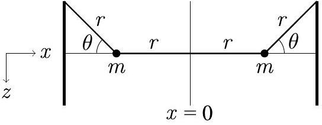

**6. String-coupled masses (5 points)** — *Aleksi Kononen.*

Two small masses $m$ are connected and hung between walls by weightless strings as pictured below. The acceleration due to gravity is $g$. All oscillatory motion is assumed to have a small amplitude and the system is always in one of its normal modes (i.e. the oscillations are sinusoidal).

**i)** *(2 points)* Find $\omega_{1}$, the angular frequency of in-phase oscillations (by which the oscillation phases of the both masses are always equal), perpendicular to the plane of the figure.

**ii)** *(3 points)* Find $\omega_{2}$, the angular frequency of anti-phase oscillations (by which the oscillation phases of the both masses are always opposite), in terms of $\omega_{1}$.

