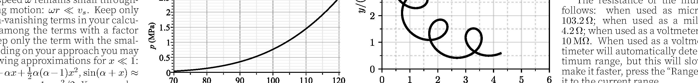
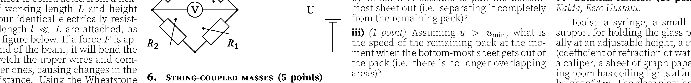

**3. Wobble (8 points)** — *Taavet Kalda.*

We investigate the so-called astrometric wobble method for detecting exoplanets. The method relies on the ability to measure the change in position in the sky that the host star experiences due to the gravitational influence of its orbiting planets. This method has become feasible in recent years due to the availability of more precise instruments.

**i)** *(2.5 points)* Consider a system consisting of a host star, an inner planet $A$, and an outer planet $B$. Below is a measurement of the trajectory of the centre of the star in the plane perpendicular to the line of sight, measured over a period of $t=10 \mathrm{yr}$. In all of the subsequent parts, you may assume that both planets orbit in circular orbits in the plane of the diagram. What are the orbital periods $T_{A}$ and $T_{B}$ of the two planets?

**ii)** *(2.5 points)* Based on direct imaging of planet $A$ in the infrared, the orbital radius of planet $A$ is measured to be $a_{A}=1.5 \mathrm{AU}=2.2 \times 10^{8} \mathrm{~km}$. What is the mass $M$ of the host star, and the mass $m_{A}$ of planet $A$ ? The gravitational constant is $G=6.67 \times 10^{-11} \mathrm{~m}^{3} \mathrm{~kg}^{-1} \mathrm{~s}^{-2}$.

**iii)** *(1 point)* What is the mass $m_{B}$ of planet $B$ ?

**iv)** *(2 points)* Now consider a similar $t=10 \mathrm{yr}$ measurement of a different system shown below, also consisting of a host star and two planets $A$ and $B$ (where $A$ is the inner planet). Similarly to before, find the mass $M$ of the host star, and the masses $m_{A}, m_{B}$ of the planets in the new system. As before, direct imaging yields that the orbital radius of planet $A$ is $a_{A}=1.3 \mathrm{AU}=2.0 \times 10^{8} \mathrm{~km}$.

