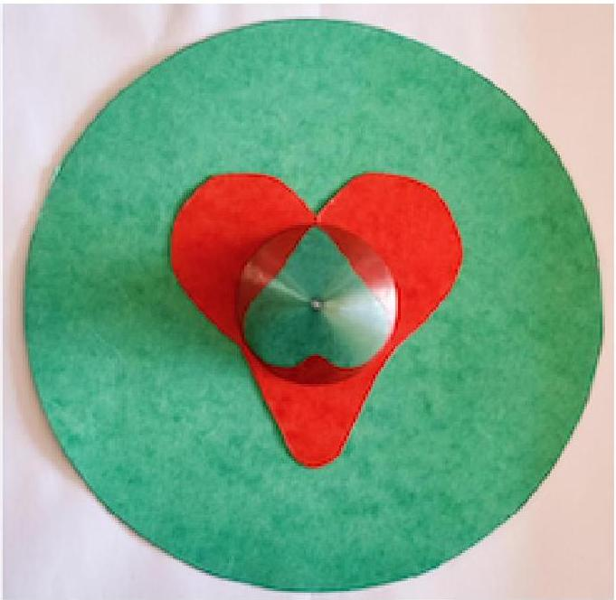

**6. Cones (8 points)** — *Jaan Kalda, Eppu Leinonen.*

**i)** *(2 points)* The photo below shows a self-anamorphic drawing - a red heart in green background. The reflection of the red heart in the conical mirror is a reduced green heart. What is the apex angle of the conical mirror? You can take measurements from the photo. The distance where the photo was taken was much larger than the diameter of the red heart.

Photo by Erik Mahieu, cf. https://community.wolfram.com/groups/-/m/t/2027565.

**ii)** *(1 point)* A point-like puck of mass $m$ can slide frictionlessly along the internal surface of a cone of half apex angle $\theta$. The gravitational acceleration is $g$ and points along the symmetry axis of the cone at the apex. The puck starts sliding from a point $P$ on the surface of the cone with such a horizontal velocity that it will stay moving at the same fixed height while performing uniform circular motion of radius $R$. What is its speed $v$ ?

**iii)** *(2.5 points)* Now the puck starts sliding horizontally from the same point $P$ as before, but its initial speed is reduced to $v / 2$. What is the smallest distance between the puck and the cone's axis during the subsequent motion?

**iv)** *(2.5 points)* Now, the cone and the puck are moved to weightlessness. The puck starts again from the point $P$ with the same velocity as in part ii). By how many degrees will the radius vector drawn from the cone's axis to the puck rotate during the subsequent motion? Assume that the cone is infinitely long.
