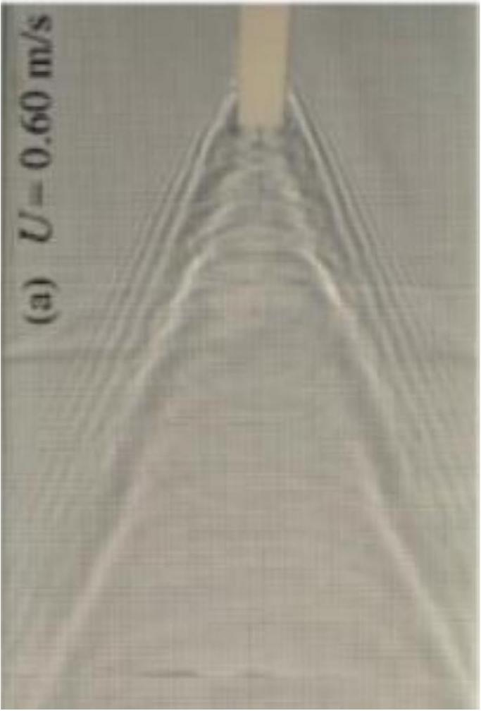

**7. Waves (4 points)** — *Janis Huns, Jaan Kalda.*

The dispersion relation (i.e. the dependence of the circular frequency $\omega$ on the wave vector $k=\frac{2 \pi}{\lambda}$) of capillary-gravity waves is

$$\omega^{2}=g k^{\alpha}+\frac{\sigma}{\rho} k^{\beta},$$

where $\sigma$ denotes the surface tension, $g=9.81 \mathrm{~m} \mathrm{~s}^{-2}$, and $\rho=1000 \mathrm{~kg} \mathrm{~m}^{-3}$.

**i)** *(1 point)* Determine the values of the exponents $\alpha$ and $\beta$.

F. Moisy, M. Rabaud, PRE 90, 023009 (2014)

**ii)** *(3 points)* In the image above, we can see how an object moving with a constant speed $U=60 \mathrm{~cm} \mathrm{~s}^{-1}$ generates a wake - a set of waves of different wavelengths. Pay attention to the short-wavelength waves whose wave crest extends from the object almost up to the edges of the photo: the presence of a very long wavefront testifies that for these particular waves, the phase and group velocities are equal. Determine the surface tension of water. You can take measurements from the photo. Note that while phase speed is the speed of a constant phase of the wave, the group speed $v_{g}=\frac{\mathrm{d} \omega}{\mathrm{d} k}$ is the speed of a wave packet (a train of waves).
