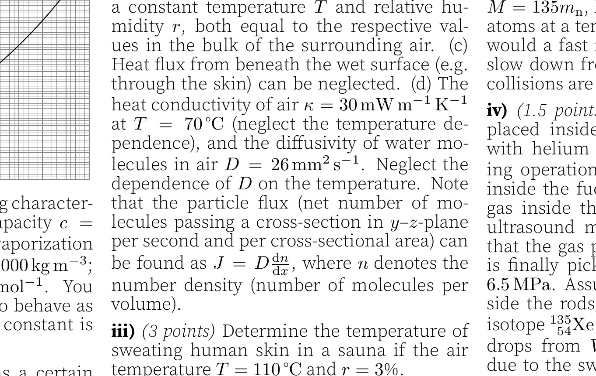

**2. Evaporation (7 points)** — *Jaan Kalda.*

For the subsequent tasks, the graph shows how the density of saturated water vapour in $\mathrm{g} \mathrm{m}^{-3}$ depends on the temperature in ${ }^{\circ} \mathrm{C}$.

You may also use the following characteristics of water. Specific heat capacity $c= 4200 \mathrm{~J} \mathrm{~kg}^{-1} \mathrm{~K}^{-1}$; latent heat of vaporization $L=2260 \mathrm{~kJ} \mathrm{~kg}^{-1}$; density $\rho=1000 \mathrm{~kg} \mathrm{~m}^{-3}$; molar mass of water $\mu=18 \mathrm{~g} \mathrm{~mol}^{-1}$. You may also assume water vapour to behave as an ideal gas. The universal gas constant is $R=8.31 \mathrm{~J} \mathrm{~mol}^{-1} \mathrm{~K}^{-1}$.

**i)** *(2 points)* A cylinder contains a certain amount of water at temperature $T_{0}=90^{\circ} \mathrm{C}$, see the figure. The cross-sectional area of the piston is $S=1 \mathrm{dm}^{2}$. What is the minimum pulling force required to move the piston? The pressure of the surrounding air is $p_{0}=100 \mathrm{kPa}$.

**ii)** *(2 points)* If the piston is pulled so that it shifts by $a=3 \mathrm{dm}$, the water cools to a temperature of $T_{1}=89^{\circ} \mathrm{C}$; what is the mass of the water under the piston?

Water evaporation has a cooling effect the intensity of which depends on the relative humidity and air convection intensity. It appears, however, that once a dynamical thermal equilibrium is reached, the equilibrium temperature of a wet surface depends only on the relative humidity and the temperature of air and does not depend on the convection speed (as long as the convection is not too weak). This is so because the two competing processes determining the equilibrium state both depend on the thickness of the laminar (non-turbulent) surface layer exactly in the same way. In what follows we shall use the following assumptions.

(a) Atop a wet surface (such as a sweating bare skin), there is a layer with a laminar flow of a certain thickness $d$.

(b) Atop the laminar layer, the surrounding turbulent flow keeps a constant temperature $T$ and relative humidity $r$, both equal to the respective values in the bulk of the surrounding air.

(c) Heat flux from beneath the wet surface (e.g. through the skin) can be neglected.

(d) The heat conductivity of air $\kappa=30 \mathrm{~mW} \mathrm{~m}^{-1} \mathrm{~K}^{-1}$ at $T=70^{\circ} \mathrm{C}$ (neglect the temperature dependence), and the diffusivity of water molecules in air $D=26 \mathrm{~mm}^{2} \mathrm{~s}^{-1}$. Neglect the dependence of $D$ on the temperature. Note that the particle flux (net number of molecules passing a cross-section in $y-z$-plane per second and per cross-sectional area) can be found as $J=D \frac{\mathrm{~d} n}{\mathrm{~d} x}$, where $n$ denotes the number density (number of molecules per volume).

**iii)** *(3 points)* Determine the temperature of sweating human skin in a sauna if the air temperature $T=110^{\circ} \mathrm{C}$ and $r=3 \%$.
