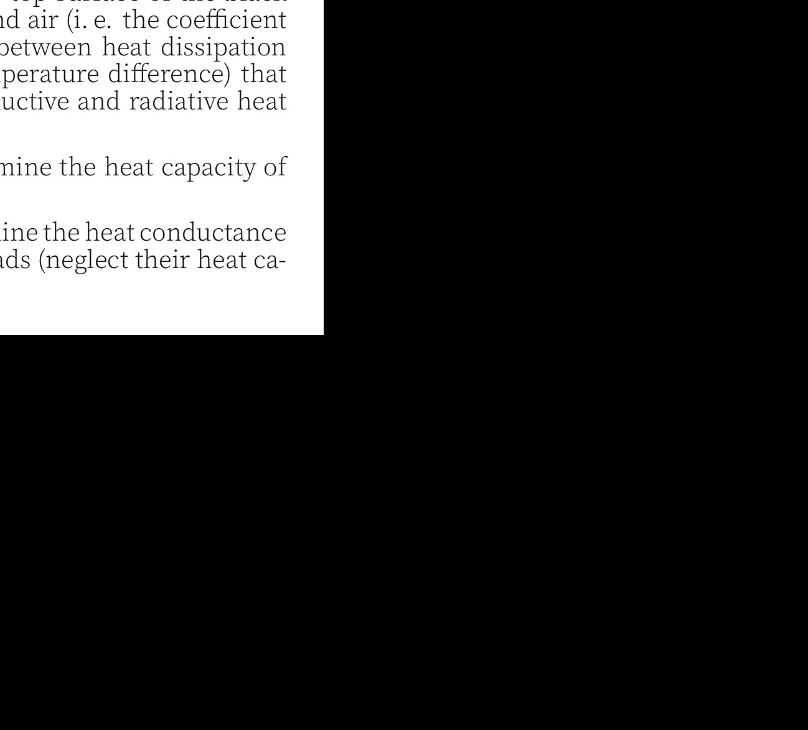

**8. Phase Spiral (9 points)** — *Taavet Kalda.*

Here we shall study the motion of Milky Way stars in the Solar neighbourhood in the direction of the $z$-axis, i.e. perpendicular to the galactic plane. For our purposes, we can model the galactic gravity field as being created by a continuous mass density $\rho$ (that accounts for the masses of stars, dark matter, gas, interstellar dust, etc), and assume that this mass forms an infinite mirror-symmetric plate, i.e. $\rho \equiv \rho(z)$ and $\rho(z)= \rho(-z)$ is independent of $x$ and $y$. Throughout the problem, you may assume that each star's total energy is conserved over the entire considered time period. Gravitational constant $G=6.67 \times 10^{-11} \mathrm{~m}^{3} \mathrm{~kg}^{-1} \mathrm{~s}^{-2}= 4.30 \times 10^{-3} \mathrm{pc} \mathrm{M}_{\odot}^{-1}(\mathrm{~km} / \mathrm{s})^{2}$.

**i)** *(1 point)* Assuming that the mass density is constant over the plate's thickness, i.e. $\rho(z)=\rho_{0}$, what is the acceleration $a_{z}$ of a star at a distance $z$ from the mid-plane?

**ii)** *(0.5 points)* Consider a star that starts with zero velocity at a distance of $z=a$ from the mid-plane. With what period does it start oscillating around the mid-plane?

In reality, density decreases with growing $|z|$. Measuring density has been a great challenge because of contributions from dark and other difficult-to-see matter. Here, we consider a breakthrough method of doing it. Consider the distributions of the stars in our neighbourhood on the $z-v_{z}$ phase plane, where each star is a dot with coordinates $\left(v_{z}, z\right) ; v_{z}$ denotes the $z$-component the star's velocity, and $z$ - the vertical coordinate. Initially, these dots were distributed nearly homogeneously, but some time ago, the Milky Way was perturbed externally, probably by a passing-by dwarf galaxy; this shuffled the positions and velocities of stars, creating a bar-shaped overdensity region. When moving within that bar-shaped region from the centre to the periphery, the total energy per mass of stars increased monotonously. Over time, this overdensity region started "winding up", due to the oscillation periods of stars in the vertical plane depending on their oscillation amplitude $z_{\mathrm{m}}$, and evolved into a spiral pictured below (Antoja et al. 2018, Nature 561, 360). An observation that you need to exploit below is that the ordering of stars by energies along the spiral today remains the same as it was at the time of perturbation.

The oscillation period of stars depends on the amplitude $z_{\mathrm{m}}$ because the gravitational potential (the potential energy per mass) $\Phi(z)$ is not parabolic. In such a case, the period can be approximately found by substituting the real $\Phi(z)$ with a $k z^{2}$ matching $\Phi(z)$ at $z=z_{\mathrm{m}}$, i.e. with $k=\Phi\left(z_{\mathrm{m}}\right) / z_{\mathrm{m}}^{2}$.

**iii)** *(2.5 points)* At the intersection points of the spiral with $v_{z}=0$, calculate $\Phi(z)$ by interpolating data linearly where appropriate; plot your results (this follows the analysis of Guo et al. 2024, ApJ, 960, 133).

**iv)** *(1 point)* Assuming that the mass density is almost constant for $|z| \leq 0.3 \mathrm{kpc}$, what is the mass density near $z=0$ ?

**v)** *(2 points)* Dark matter is an "invisible" form of matter that only interacts by gravity. In general, it is found that dark matter forms...

**vi)** *(2 points)* How long ago did the perturbation occur?
