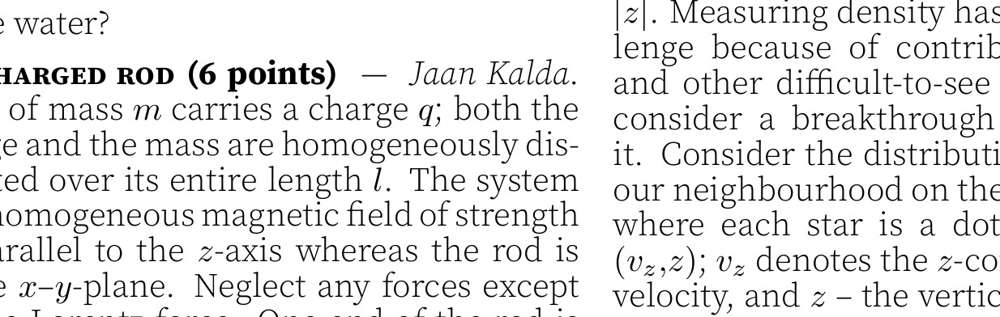

**5. Throwing (6 points)** — *Eppu Leinonen.*

**i)** *(2 points)* A drone starts from the origin at rest and accelerates horizontally with an acceleration $g$ to the $+x$ direction. Simultaneously, a ball is thrown from the point with coordinates $(x, y)=(-h,-h)$. What is the minimum initial speed the ball needs to hit the drone? The free fall acceleration $g$ is antiparallel to the $y$-axis.

**ii)** *(4 points)* A stone is thrown from point $S$ (shown in the figure below) with an initial speed $v$. A boy at point $B$ wishes to hit the stone in midair by throwing a ball simultaneously with the stone's release. He wants to use the minimum possible speed $u$ that will still allow the ball to hit the stone in midair. After calculating the stone's trajectory, he determines the optimal trajectory for the ball and throws it according to his calculations. The collision point $C$ is shown in the figure. Using the scale provided and necessary measurements from the figure, find the initial speeds $v$ of the stone and $u$ of the ball. The free fall acceleration is $g=9.8 \mathrm{~m} \mathrm{~s}^{-2}$.

