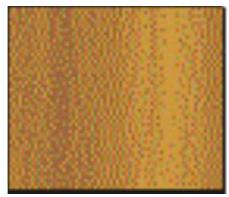
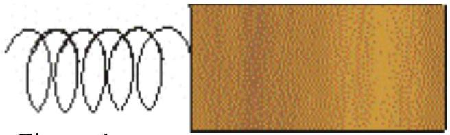
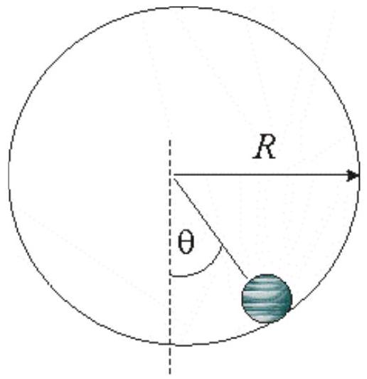
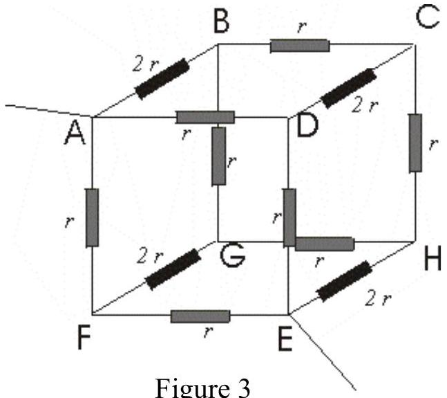

1. This is Part II of a two-part test. This part of the test is a three-hour test.
2. This paper consists of four (4) questions and five (5) pages.
3. Attempt all questions. Each question carries equal marks.
4. Write your name legibly on the top right hand corner of every answer sheet you submit.
5. Begin each answer on a fresh sheet of paper.
6. Submit all your working sheets. No paper, whether used or unused, may be taken out of this examination hall.
7. No books or documents relevant to the test may be brought into the examination hall.

## Theoretical Paper: Part II

1 (a) A block $P$ of mass $m \mathrm{~kg}$ slides along a horizontal frictionless track with speed $v$ $\mathrm{ms}^{-1}$. The block collides with another stationary block $Q$ of mass M kg that has a light spring (of spring constant $k$ ) attached to it as shown in the figure 1. As the blocks collide, block $P$ slows down while block $Q$ speeds up and the spring compresses. Stating any assumptions, find the maximum compression of the spring.

Figure 1

(b) A solid sphere with radius $r$ and mass $m$ rotates inside a hollow sphere of radius $R$ as shown figure 2. Calculate the period of small oscillations about the equilibrium. You may take the moment of inertia of the solid sphere as $2 / 5 m r^{2}$.

Figure 2

(c) ABCDEFGH is a cuboid with resistances $2 r$ along the edges AB, CD, FG and EH and resistance r along the rest of the edges. Find the equivalent resistance of the circuit between the points $A$ and $E$ as shown in figure 3
(d) Find the energy and wavelength of a photon that can impart a maximum energy of 60 keV to a free electron.
(e) A lens is coated with a thin film with a refractive index of 1.2 in order to reduce the reflection from the surface at a wavelength of $5000 \AA$. The glass of the lens has refractive index 1.4. What is the minimum thickness of the coating that will minimize the intensity of the reflected light? Explain why the intensity of the reflected light is small but not zero.
