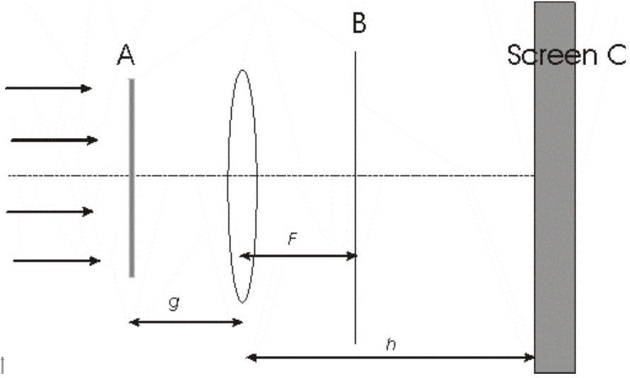

3. Phase contrast microscopy can be used to improve the image of transparent biological microbes. The instrument essentially consists of a lens of focal lens f with diameter D as shown in figure 4. A laser beam of wavelength $\lambda$ illuminates the entire aperture of the lens. The laser beam is parallel to the axis of the lens.
(a) If a transmission grating of line separation d is placed at A, describe the pattern on a screen placed at B.
(b) Suppose you wish to photograph a microbe placed at A (in placed of the grating) and the film is placed on the screen C, how far is C from the lens?
(c) A phase plate is used to improve the microscope. Light goes through the circular phase plate within a distance x from the center suffers a $\pi / 2$ phase lag. The plate is placed at B, centered on the optical axis of the lens, with its surface normal to the optical axis. Suppose the refractive index of the microbe differs only slightly from the surrounding medium so that light which passes through the microbe is slightly phase shifted. Compare the image with the addition

Figure 4

of the phase plate to the image without the phase plate. How large should x be? If the center of the phase plate is opaque, how is the image changed?
