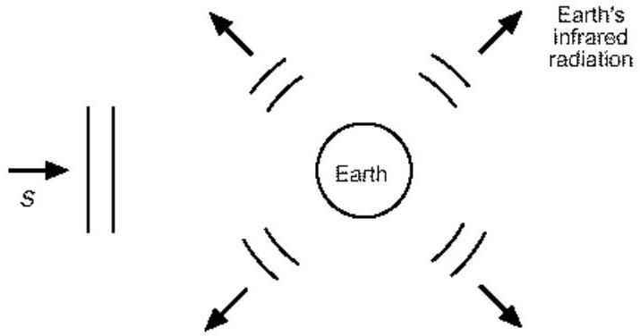
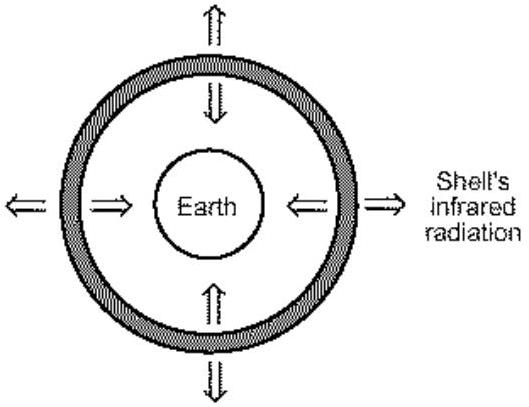

4. (a) The interior of the Earth can roughly be modelled as follows: it consists of a molten core 3440 km in radius, a mantle surrounding the core with thickness 2900 km, and a rocky crust with thickness 30 km. Heat is generated from within the core due to the decay of radioactive elements, and conducts upwards to the surface through the mantle and crust.

Suppose the core generates $4 \times 10^{13} \mathrm{~W}$ of heat and its outer temperature is $3700^{\circ} \mathrm{C}$. If the thermal conductivity of the mantle and the crust is $157 \mathrm{~W} /\left(\mathrm{m} \cdot{ }^{\circ} \mathrm{C}\right)$ and $2.35 \mathrm{~W} /\left(\mathrm{m} \cdot{ }^{\circ} \mathrm{C}\right)$ respectively, what is the resulting temperature at the surface of the Earth assuming there are no other forms of heat gain or loss?

Hint: The rate at which heat flows by conduction through a slab of cross-sectional area $A$ and infinitesimal thickness $d x$ is

$$
H=-k A \frac{d T}{d x}
$$

where $d T$ is the temperature difference and $k$ is the thermal conductivity.
(b) Of course, heat also reaches the Earth's surface from the Sun. The Sun delivers radiation to the Earth at a rate of $1400 \mathrm{~W} / \mathrm{m}^{2}$, measured at right angles to the Sun's rays. However, we must allow for the fact that 30\% of the solar radiation is reflected back out to space without being absorbed.

Now, the Earth's surface also radiates infrared

radiation back into space. Assuming it radiates like a blackbody, what is the average temperature of the Earth's surface? [Stefan-Boltzmann constant $\sigma$ $\left.=5.7 \times 10^{-8} \mathrm{~W} /\left(\mathrm{m}^{2} \mathrm{~K}^{4}\right)\right]$
(c) A more realistic model takes into account the greenhouse warming effect of the atmosphere. This is done by treating the atmosphere as a spherical shell enclosing the Earth. It is transparent to incoming (visible) solar radiation but absorbs some of the outgoing infrared radiation from the Earth's surface. It is thus heated to a certain temperature and radiates its own infrared radiation, from both the inner and outer surfaces.

Assume that the shell absorbs 75\% of the outgoing infrared

radiation, and that its (inner or outer) surface area is the same as that of the Earth's surface. Hence calculate the new value for the temperature of the Earth's surface. This value includes the greenhouse warming!
