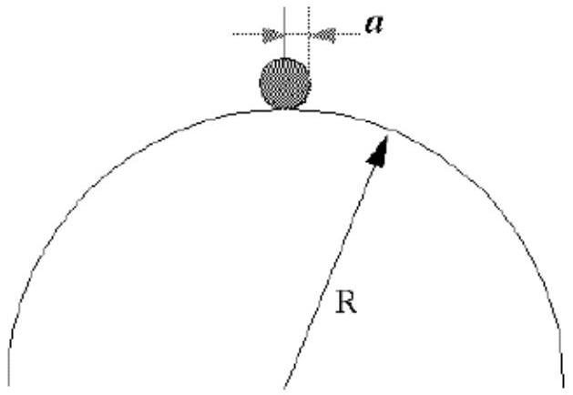
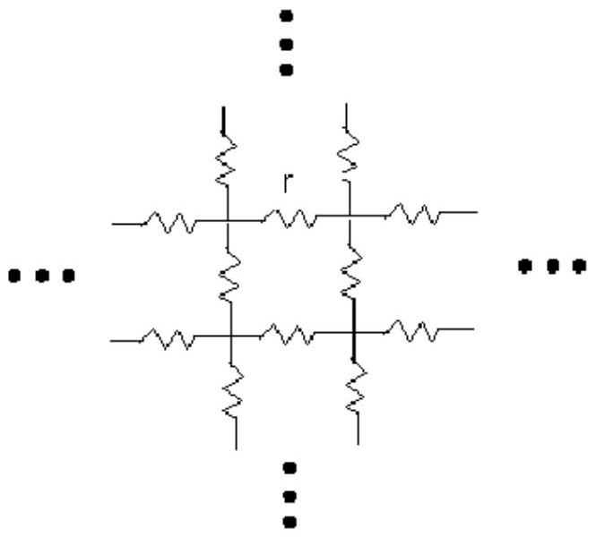

1. (a) A nucleus of mass $M_{1}$ and kinetic energy $K_{1}$ moves along the $x$-axis and is incident on a stationary nucleus of mass $M_{2}$. The collision results in two new nuclei, one of them of mass $M_{3}$ and kinetic energy $K_{3}$, moving at an angle of $\phi$ to the $x$-axis and the other one of mass $M_{4}$ and kinetic energy $K_{4}$, moving at an angle of $\theta$ to the $x$-axis. Assuming that the particles are moving at non-relativistic speeds, show that the Q-value of the reaction (difference in energies before and after the reaction) is

$$
Q=K_{3}\left(1+\frac{M_{3}}{M_{4}}\right)-K_{1}\left(1-\frac{M_{1}}{M_{4}}\right)-\frac{2 \sqrt{M_{1} K_{1} M_{3} K_{3}}}{M_{4}} \cos \phi
$$

(b) Two wavelengths $\lambda$ and $\lambda+\Delta \lambda$ (with $\Delta \lambda \ll \lambda$ ) are incident on a diffraction grating with slit separation, $d$. Show that the angular separation between the spectral lines in the $m$ th order spectrum is

$$
\Delta \theta=\frac{\Delta \lambda}{\sqrt{\left(\frac{d}{m}\right)^{2}-\lambda^{2}}} .
$$

(c) A marble rests on the top of a hemispherical bowl as shown in the figure below. The radii of the bowl and the marble are $R$ and $a$ respectively. The marble is displaced from rest and it rolls down the bowl without slipping. At what height, in terms of $R$ and $a$, will the marble leaves the hemispherical?

(d) Consider the infinite square array of resistors each of resistance $r$ as shown in the figure. Find the equivalent resistance between two neighboring point separated by a resistor $r$.

