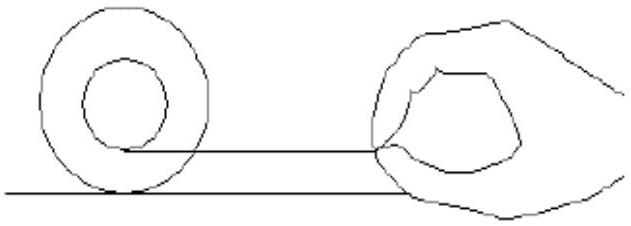

3. A yo-yo is constructed of two brass disks whose thickness $b$ is 8.5 mm and whose radius $R$ is 3.5 cm joined by a short axle whose radius $R_{0}$ is 3.2 cm.
(i) Neglecting the moment of inertia of the axle and taking the density of brass to be $8400 \mathrm{~kg} \mathrm{~m}^{-3}$, what is the moment of inertia about the central axis?
(ii) A string of length 1.1 m and negligible thickness is wound on the axle. What is the linear acceleration of the yo-yo as it rolls down the string from rest?
(iii) Calculate the tension in the string of the yo-yo.
(iv) The yo-yo is then held on level surface. A gentle horizontal pull is exerted on the cord so that the yo-yo rolls without slipping. The yo-yo will roll towards the pull. Explain quantitatively using appropriate

equations why this is so.
