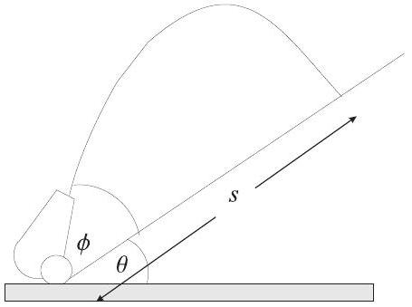

1. (a) A cannon fires a shot at an angle of $\phi$ up a plane inclined to the horizontal at angle $\theta$ as shown in Fig 1. In terms of $\theta$, at what angle, $\phi$, should the shot be fired in order to maximize the distance $s$ up the inclined plane? Explain clearly how you obtain your answer. [8 marks]

Figure 1: Cannon firing shot up an inclined slope.

    (b) In its rest frame, a source emits light in a conical beam of width ±60°. For a the frame moving towards the source at high speed $v$, comparable to the speed of light $c$, the beam width is ±45°. Determine the value of $v$. [8 marks]
    (c) A telephone wire of diameter 1 mm is suspended parallel to the ground at a height of 10 m. Determine the capacitance to the ground of this wire per unit length. (You may assume the ground to be a conducting plane). [7 marks]
    (d) (i) Explain why the decay of radioactive material obeys an exponential law.
        (ii) A age of a piece of wood is determined by measuring its radioactivity of carbon-14. The proportion of carbon-14 to carbon-12 in living wood is about $1.25 \times 10^{-12}$. When the piece of wood dies, the carbon-14 decays with a half life of 5600 years. If the number of disintegrations measured from 10.0 g of carbon prepared from a piece of wood is 48 per minute, estimate the age of the wood (in years).

[7 marks]

(e) The lowest temperature in outer space (cosmic microwave background radiation) is about 2.7 K. Determine the root mean square speed of hydrogen molecules at this temperature. Molecular motions are not maintained by external forces, and yet continue indefinitely with no sign of diminishing speed. Why does friction or collision not bring these tiny particles to rest? [5 marks]

$$
\begin{array}{ll}
1 \text { year } & 3.16 \times 10^{7} \mathrm{~s} \\
\text { Avogadro's number } & \mathrm{N}=6.023 \times 10^{23} \mathrm{~mole}^{-1} \\
\text { Proton mass } & m_{p}=1.67 \times 10^{-27} \mathrm{~kg}^{-} \\
\text {Boltzmann's constant } & k=1.38 \times 10^{-23} \mathrm{~J} \mathrm{~K}^{-1} \\
\text { Permittivity constant } & \epsilon_{0}=8.85 \times 10^{-12} \mathrm{Fm}^{-1} \\
\text { Speed of light } & c=2.997 \times 10^{8} \mathrm{~ms}^{-1}
\end{array}
$$
