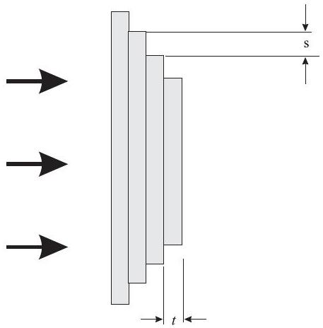

2. (a) A peacock feather viewed under a microscope is dull with uniform purplish color. However, peacock feathers glimmers under normal lighting and if you change your perspective the tint of color changes. The feather is said to be iridescent. Explain the cause of this iridescence? [5 marks]
    (b) A transmitting antenna for radio waves of wavelength 5 m is located on a cliff overlooking an open sea. The cliff is 200 m above sea level.
        (i) An aeroplane flying just above the surface of the water 20 km away cannot receive signals from the antenna and thus does not reflect echo signals back to the transmitting site. Explain qualitatively why this is so. [5 marks]
        (ii) If the plane is flying at certain attitudes above the water surface, the plane will reflect exceptionally strong echoes. Determine these attitudes. [6 marks]
    (c)Fig 2 shows a transmission echelon. It is made of a stack of $N$ glass plates of refractive index $n$ and thickness $t$, assembled so that each plate projects a distance $s$ beyond the preceding one.

Figure 2: Transmission echelon.
    (i) The stack is is illuminated from the left with monochromatic light of wavelength $\lambda$. By considering the light coming from each step to the assembly, what is the condition for constructive interference beyond the stack for small angles with respect to the incident beam? [8 marks]
    (ii) Determine the order of the interference for $n=1.5, t=0.5 c m$ and $\lambda=5 \times 10^{-9} \mathrm{~m}$ ? [5 marks]
    (iii) Calculate the angular dispersion and resolving power for a stack of 40 plates of this index and thickness, assuming that there is negligible variation in the refractive indices. [6 marks]
