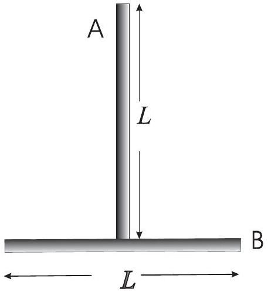

3. (a) A singer, holding a note of the right frequency, can shatter a glass if the glassware is of high quality. This cannot be done with one of low quality. Explain why. [5 marks]
    (b)A T-shaped structure is formed from two uniform rods, $A$ and $B$, each of length $L$ and mass $m$ (see figure 3). The mid-point of rod $B$ is attached to one end of rod $A$. A point mass $m$ moving horizontally at right angles to $\operatorname{rod} A$ strikes the end of $\operatorname{rod} B$ with an initial velocity $V$ and sticks to it.

Figure 3: T-shaped structure formed from two rods.

        (i) Find the position of point on the T-shaped structure which remains stationary. [5 marks]
    (ii) Determine the angular velocity of system immediately after the collision. [5 marks]
    (iii) Sketch the positions of the T-structure in subsequent motion. [5 marks]
    (iv) Find out the change in kinetic energy of the system as a result of collision. [5 marks]

The T-structure is then suspended from the free end of $\operatorname{rod} A$ and allowed to move freely in the plane of the " T ". Show that the period of small oscillation is

$$
2 \pi \sqrt{\frac{17 L}{18 g}} .
$$

[5 marks]
