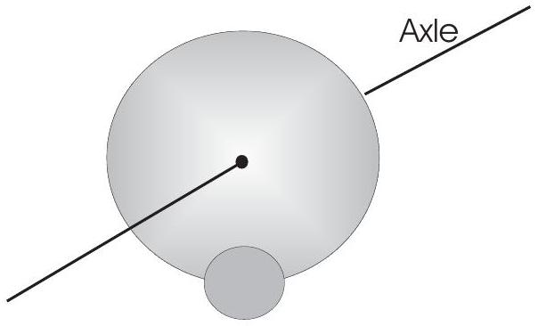

5. A small thin disk of radius $r$ and mass $m$ is attached rigidly to the face of a second thin disk of radius $R$ and mass $M$ as shown in Fig. 1. The center of the small disk is located at the edge of the large disk. The large disk is mounted at its center on a frictionless horizontal axle. The assembly is rotated through an angle $\theta$ from its equilibrium position and released.
    (i) Find the speed of the center of the small disk as it passes through the equilibrium position in terms of $R, r, M, m$ and acceleration due to free fall, $g$. [7]
    (ii)Determine the period of small oscillation. in terms of $R, r, M, m$ and $g$. [7]

Figure 1: Oscillatory disks
