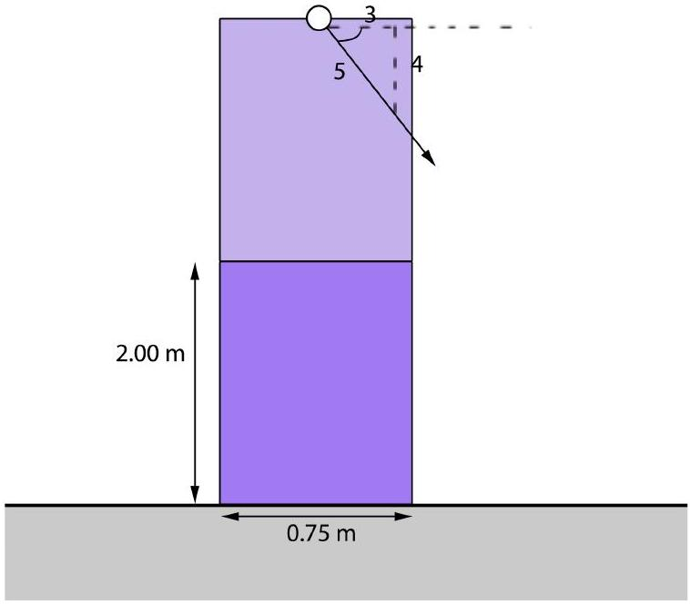

2. A column is formed of two marble blocks each weighing 15 kN sitting atop each other. A rope to which a force F is applied is attached at the top (of the top marble block). The friction coefficient between the marble and the ground is $\mu_{\mathrm{M}-\mathrm{G}}=0.15$ while the friction coefficient between marble and marble is $\mathrm{u}_{\mathrm{M}-\mathrm{M}}=0.20$. What is the maximum load $\mathrm{F}_{\text {max }}$ that can be applied? [8 marks]

