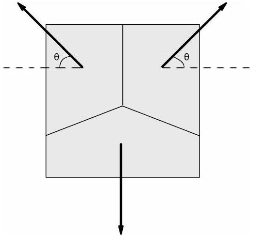

4. (a)A projectile is fired from ground level with an initial velocity of $\mathrm{V}_{\mathrm{o}}$ at an angle of $\theta$ above the horizontal. Show that the maximum height H is given by $H=\frac{V_{o}^{2} \sin ^{2} \theta}{2 g}$ where $g$ is the acceleration of free fall. [4 marks]
    (b) A rocket is projected upwards and explodes into three equally massive fragments just as it reaches the top of its flight. One of the fragments if observed to fall downwards in time $\mathrm{t}_{1}$ as shown in Figure 4 while the other two land after a time $\mathrm{t}_{2}$ after the burst. Determine the height $\mathrm{h}\left(\mathrm{t}_{1}, \mathrm{t}_{2}\right)$ at which the fragmentation occurs. [8 marks]

