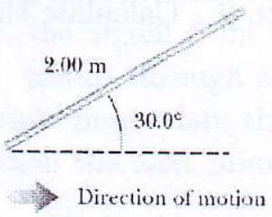

10. A moving rod is observed to have a length of 2.00 m and to be oriented at an angle of $30.0^{\circ}$ with respect to the direction of motion, as shown in Figure 4. The rod has a speed of $0.995 c$, where $c$ is the speed of light in vacuum.
    (i) What is the proper length of the rod?
    (ii) What is the orientation angle in the proper frame? [5]

Figure 4: Moving rod

## SOME FUNDAMENTAL CONSTANTS OF PHYSICS

| Constant | Symbol | Computational value |
| :--- | :--- | :--- |
| Avogadro's number | $N$ | $6.023 \times 10^{23} \mathrm{~mole}^{-1}$ |
| Boltzmann constant | $k$ | $1.38 \times 10^{23} \mathrm{JK}^{-1}$ |
| Elementary charge | $e$ | $1.6 \times 10^{-19} \mathrm{C}$ |
| Electron rest mass | $m_{e}$ | $9.11 \times 10^{-31} \mathrm{~kg}$ |
| Neutron rest mass | $m_{n}$ | $1.68 \times 10^{-27} \mathrm{~kg}$ |
| Proton rest mass | $m_{p}$ | $1.67 \times 10^{-27} \mathrm{~kg}$ |
| Planck's constant | $h$ | $6.63 \times 10^{-34} \mathrm{Js}$ |
| Permittivity constant | $\epsilon_{0}$ | $8.85 \times 10^{-12} \mathrm{Fm}^{-1}$ |
| Permeability constant | $\mu_{0}$ | $4 \pi \times 10^{-7} \mathrm{Hm}^{-1}$ |
| Stefan's constant | $\sigma$ | $5.68 \times 10^{-8} \mathrm{Wm}^{-2} \mathrm{~K}^{4}$ |
| Speed of light in vacuum | $c$ | $2.997 \times 10^{8} \mathrm{~ms}^{-1}$ |
| Unified atomic mass unit | $u$ | $1.66 \times 10^{-27} \mathrm{~kg}$ |
| Universal gas constant | $R$ | $8.31 \mathrm{~J} \mathrm{~mol}^{-1} \mathrm{~K}^{-1}$ |
| Gravitational constant | $G$ | $6.67 \times 10^{-11} \mathrm{~N} \mathrm{~m}^{2} \mathrm{~kg}^{-2}$ |
| Mass of Earth | $M_{E}$ | $6 \times 10^{24} \mathrm{~kg}$ |
| Radius of Earth | $R_{E}$ | $6.4 \times 10^{6} \mathrm{~m}$ |
| Mean Earth-Sun distance | $R_{S E}$ | $1.495 \times 10^{11} \mathrm{~m}$ |
