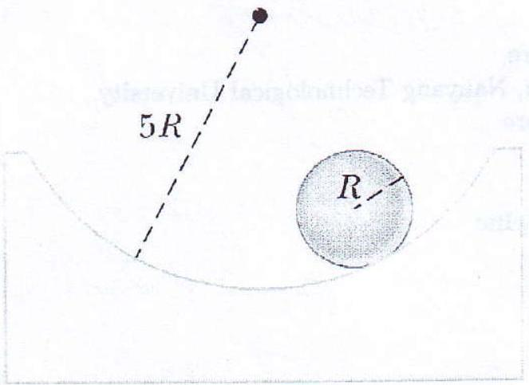

2. A solid sphere of radius $R$ rolls without slipping in a cylindrical trough of radius $5 R$ as shown in Figure 1. Show that, for small displacements from equilibrium perpendicular to the length of the trough, the sphere executes simple harmonic motion. Determine the period of the simple harmonic motion. [8]

Figure 1: Solid sphere in a cylindrical trough.
